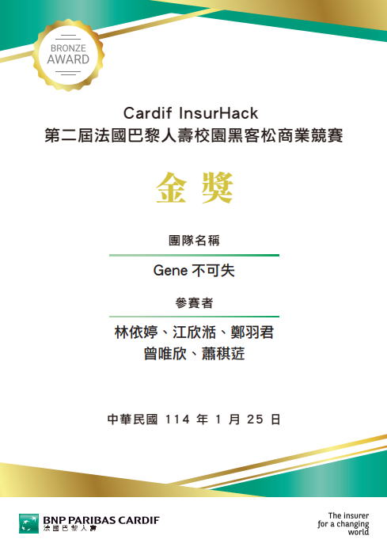
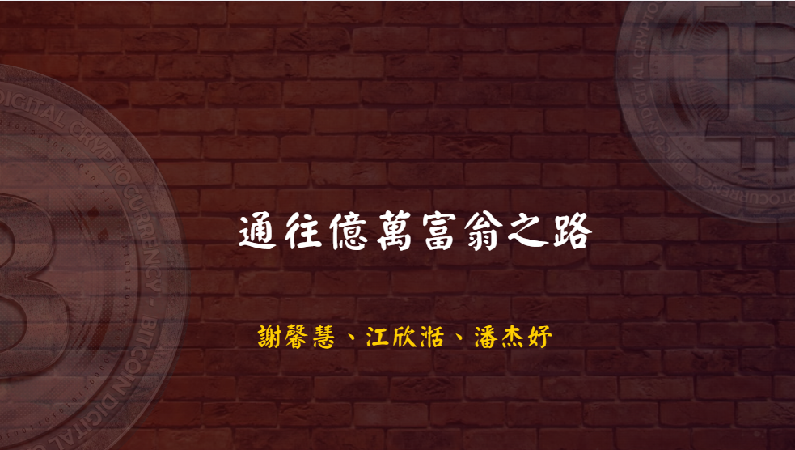
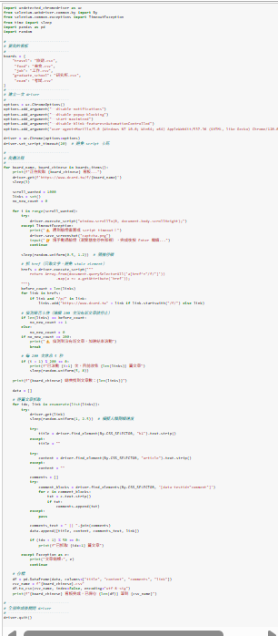
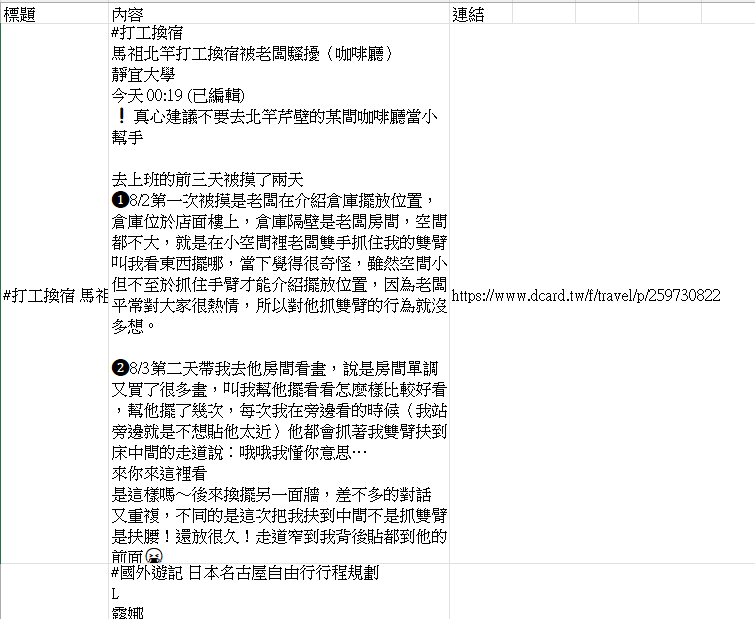
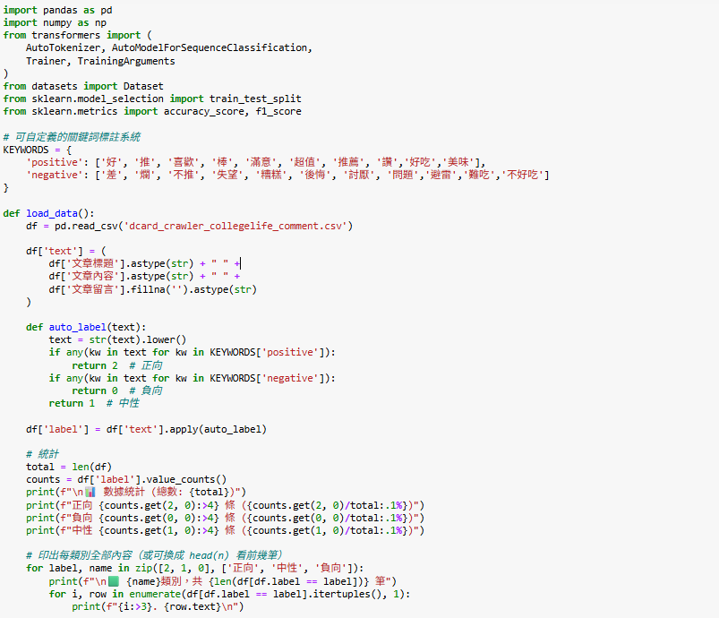

# 作品集

我的作品集一共分稱三個部分：&nbsp;比賽簡報、&nbsp;課程專題、&nbsp;畢業專題

## 一、比賽簡報

### 1、第二屆法國巴黎人壽校園黑客松競賽-榮獲 **團隊金獎**

#### (1)、作品名稱:癌症基因風險檢測保險_Gene不可失

結合基因檢測與癌症風險保險，以應對癌症年輕化、遺傳性癌症風險增加、傳統 保險賠付不足等挑戰。透過基因檢測，個人可了解罹癌風險，並依檢測結果彈性選擇適切的 保險方案。 本產品針對0至6歲嬰兒及孩童設計，經基因檢測後，根據風險配置保險點數，提供個性化 癌症保障。此保險設有彈性保費、終身保障及健康檢查補助等機制，結合訊聯基因的技術支 持，以求達到減緩經濟負擔，提升健康管理意識，為患者及家屬提供全方位支持的終旨。

作品連結:
https://reurl.cc/K9WR0m

### 2、113年度「櫃買30-大專生證券菁英種子線上培育營」

#### (1)、作品名稱:通往億萬富翁之路

該培育營分下面兩階段進行：

#### (1.1)第一階段為線上學習課程 

課程內容包含我國資本市場特色與監理重點、認識證券櫃檯買賣中心、櫃買中心股票交易制度與實務介紹及ETF簡介及認識投資風險

#### (1.2)第二階段為櫃買商品投資組合線上簡報競賽

競賽題目：就新台幣50,000,000元可運用資金，規劃櫃買商品投資組合，簡報內容應包含總經及產業分析與投資組合分析。

資產配置商品範圍: 上櫃股票、興櫃股票、上櫃ETF(含債券ETF)、上櫃ETN、上櫃權證、上櫃債券等櫃檯買賣商品。

先透過總經、產業新聞、財報資訊及產業分析，進行各個產業發展趨勢的評估分析。

再從較具發展潛力的個別產業中，挑選該產業具發展潛力的個別公司。

最後分析並選出值得投資之個股建議。

作品連結:
https://reurl.cc/NxMgOn

### 二、課程專題

#### 1、社群網路分析

##### (1)、作品名稱:孫子兵法與 現代企業管理

利用二元編碼將每家公司有用到的兵法記作1，沒有用到的兵法記作0 ，接著利用ucinet 進行中心性分析，再用python畫社群網路圖，分析商場如戰場這句話是否為真。

作品連結:
https://reurl.cc/89aLAo

#### 2、文字探勘

主要是通過分析病患在醫療機構網站或社交平台上的評論來評估病患滿意度，利用文字探勘技術進行情緒分析，為醫療機構提供提升服務品質的參考依據。

作品連結:
https://reurl.cc/qYR6GE

.pdf)

### 三、畢業專題

由於畢業專題現在還在書寫中，所以沒有成果，但是可以說下我們目前的研究動機及研究方法。

研究動機:
由於目前Dcard的排行榜僅依據看板進行分類，缺乏針對看板內文內容（例如：熱門旅遊地點、美食推薦、流行話題等）的更細緻分類與分析，因此我們希望能進一步透過網路爬蟲技術，擷取Dcard中部分特定看板的文章與留言內容，並將這些內容放入置我們的聊天機器人中，再將機器人給大學生使用，幫助他們解決生活上的問題。

##### (1)、作品名稱:一站式Dcard熱門趨勢探索工具

##### (1.1)利用jupyter notebook將dcard上的研究所、工作、美食、旅遊、考試版

##### (1.1.2)爬下來的資料長這樣

##### (1.2)再將爬下來的資料放入到我們的情感分析模型之中

模型會分辨出這篇文章的情緒是正向的、負向的，還是中性的，並存成csv，然後我們打算在把正向、負向、中性的csv丟入至我們尚未寫好的聊天機器人模型之中。

.png)
