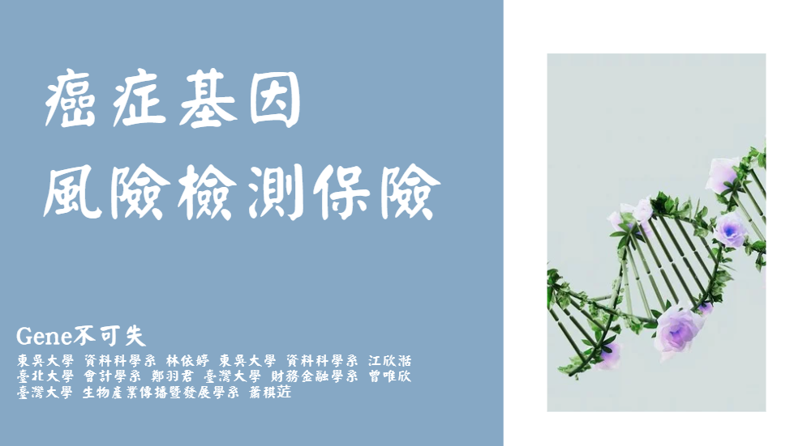
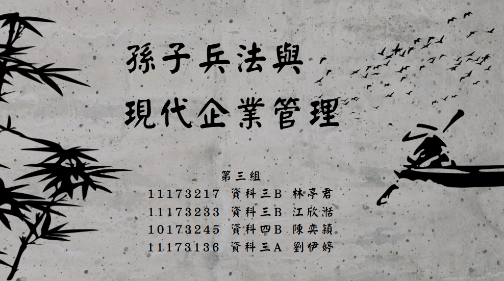

# 作品集

我的作品集一共分稱三個部分：&nbsp;比賽簡報、&nbsp;課程專題、&nbsp;畢業專題

### 一、比賽簡報

#### 1、第二屆法國巴黎人壽校園黑客松競賽-榮獲 **團隊金獎**

##### (1)、作品名稱:癌症基因風險檢測保險_Gene不可失

結合基因檢測與癌症風險保險，以應對癌症年輕化、遺傳性癌症風險增加、傳統 保險賠付不足等挑戰。透過基因檢測，個人可了解罹癌風險，並依檢測結果彈性選擇適切的 保險方案。 本產品針對0至6歲嬰兒及孩童設計，經基因檢測後，根據風險配置保險點數，提供個性化 癌症保障。此保險設有彈性保費、終身保障及健康檢查補助等機制，結合訊聯基因的技術支 持，以求達到減緩經濟負擔，提升健康管理意識，為患者及家屬提供全方位支持的終旨。

作品連結:
https://reurl.cc/K9WR0m

### 二、課程專題

#### 1、社群網路分析

##### (1)、作品名稱:孫子兵法與 現代企業管理

利用二元編碼將每家公司有用到的兵法記作1，沒有用到的兵法記作0 ，接著利用ucinet 進行中心性分析，再用python畫社群網路圖，分析商場如戰場這句話是否為真。

作品連結:
https://reurl.cc/89aLAo

#### 2、文字探勘

主要是通過分析病患在醫療機構網站或社交平台上的評論來評估病患滿意度，利用文字探勘技術進行情緒分析，為醫療機構提供提升服務品質的參考依據。

作品連結:
https://reurl.cc/qYR6GE

.pdf)
